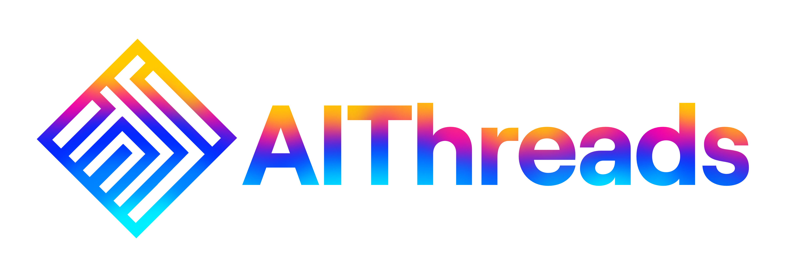

# <a href="https://ai-threads.vercel.app/">AIThreads</a>

# Project Description

AIThreads is an innovative T-Shirt design app that leverages the power of AI to create realistic 3D models of custom designs. By integrating ThreeJS, OpenAI, and Dalle APIs, it offers users an endless array of design ideas based on their inputs, including colors, themes, and graphics.

 

# Demo Video

Click the link below to watch a demo video of AIThreads in action:

<!-- [AIThreads Demo Video](https://youtu.be/_h7TlFqzQhg) -->
<video width="640" height="360" controls>
  <source src="/README_assets/AIThreads.mov" type="video/mov">
</video>
 

# Features

- Create Custom Designs: Users can create their own unique T-Shirt designs using a user-friendly interface.

- Realistic 3D Models: AIThreads utilizes ThreeJS to render stunning 3D models of the T-Shirt designs, providing a realistic preview.

- AI-Generated Design Ideas: Thanks to the integration of OpenAI and Dalle APIs, the app can generate a wide range of design ideas based on the user's preferences.

- Color Customization: Users can choose from a rich palette of colors to apply to their designs, ensuring they get the perfect look.

- Theme Selection: AIThreads offers a variety of themes, from funny and geeky to artistic and vintage, catering to diverse tastes.

- Graphics Library: The app includes a library of graphics and artwork that users can use to enhance their designs further.

 

# Technologies Used

 

# Screenshots

 

## Contributing

We welcome contributions from the open-source community. If you find any bugs or have ideas for improvements, feel free to submit an issue or a pull request.

<!--   -->

<!--  

